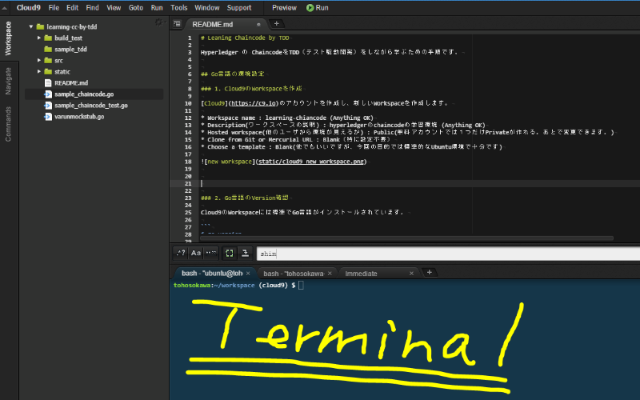

# Leaning Chaincode by TDD

Hyperledger の ChaincodeをTDD（テスト駆動開発）をしながら学ぶための手順です。


## 1. Go言語の環境設定

### 1.1. Cloud9のWorkspaceを作成

[Cloud9](https://c9.io)のアカウントを作成し、新しいWorkspaceを作成します。

* Workspace name : learning-chiancode (Anything OK)
* Description(ワークスペースの説明) : hyperledgerのchaincodeの学習環境 (Anything OK)
* Hosted workspace(他のユーザから環境が見えるか) : Public(無料アカウントでは１つだけPrivateが作れる。あとで変更できます。)
* Clone from Git or Mercurial URL : Blank（特に設定不要）
* Choose a template : Blank(他でもいいですが、今回の目的では標準的なUbuntu環境で十分です)


Workspaceを作成すると下記のような画面が表示されます。
ディレクトリ構造や、ファイルエディタ、Terminalでの処理を行えます。



### 1.2. Go言語のVersion確認

Cloud9のWorkspaceには標準でGo言語がインストールされています。

```bash
$ go version
go version go1.7.3 darwin/amd64
```

### 1.3. GOPATH環境設定

$GOPATH は設定済みです。

```bash
$ echo $GOPATH
/home/ubuntu/workspace
```

変更したい場合は、下記などのようにすることで変更可能です。
（特に変更する必要はありません。）

```
$ vi ~/.bashrc
# Add the below line at the end of file.
export GOPATH="/home/ubuntu/workspace/new/gopath"
```

```
$ source ~/.bashrc
```

### 1.4. 動作確認
go run サブコマンドを使うことでソースコードをビルドすると同時に実行する

```
$ vi helloworld.go
package main

import (
  "fmt"
)

func main() {
  fmt.Println("Hello, World!")
}
```

```
$ go run helloworld.go
Hello, World!
```

## 2. Hyperledgerの環境準備

### 2.1. サンプルのチェーンコードをクローンする

```
# Create the parent directories on your GOPATH
$ mkdir -p $GOPATH/src/github.com/hyperledger
$ cd $GOPATH/src/github.com/hyperledger 

# Clone the appropriate release codebase into $GOPATH/src/github.com/hyperledger/fabric
# Note that the v0.5 release is a branch of the repository.  It is defined below after the -b argument
$ git clone -b v0.6 http://gerrit.hyperledger.org/r/fabric
```

### 2.2. 動作確認

Buildしてエラーがないか確認します。

```
$ mkdir -p ~/workspace/build_test
$ cd ~/workspace/build_test
$ wget https://raw.githubusercontent.com/IBM-Blockchain/example02/v2.0/chaincode/chaincode_example02.go
$ go build ./
```

Buildでエラーが発生しなければ、```build_test``` という実行ファイルが出来ているはずです。

## 3. Getting started with TDD

### 3.1. モックのソースコードの事前準備

mock stub のソース (```varunmockstub.go```) を下記のディレクトリに置きます。

$GOPATH/src/github.com/hyperledger/fabric/core/chaincode/shim/


```
$ cd $GOPATH/src/github.com/hyperledger/fabric/core/chaincode/shim/
$ wget https://raw.githubusercontent.com/tohosokawa/learningCCbyTDD/cloud9/varunmockstub.go
```

上記のソースコードのオリジナルは、[チュートリアルページ](https://www.ibm.com/developerworks/cloud/library/cl-ibm-blockchain-chaincode-testing-using-golang/index.html#mockstub)の下段に置かれているものです。

### 3.2. 開発コードの準備

Workディレクトリ(sample_tdd) を作成

```
$ mkdir -p ~/workspace/sample_tdd
$ cd ~/workspace/sample_tdd
```

sample_tddディレクトリを右クリックしたり、terminalから以下2つのファイルを作成します。

1. sample_chaincode_test.go : sample_chaincode.goのテストを記述するファイル。(テスト対象コード)_test.go という命名規則がある。
2. sample_chaincode.go : 今回のローンアプリのユースケースを記述する。

```
$ touch sample_chaincode.go
$ touch sample_chaincode_test.go
```

```sample_chaincode_test.go``` を以下のように編集します。

```
package main
import (
    "fmt"
    "testing"
    "github.com/hyperledger/fabric/core/chaincode/shim"
)
```

testingパッケージをimportしているのですが、これはGoパッケージの自動テストを実装するために行います。

[Goの自動テストについての参考URLはこちらから。](http://golang.jp/pkg/testing)

さらに先程コピーしたテスト用のスタブファイル（CustomMockStub）とchaincodeを実装するために、shimをimportしています。

エディタで編集して保存すると、自動的に変更される場合（インデントの変更や空白行の挿入等）があります。
これはCloud9の標準設定では、Go言語の場合はファイル保存時に ```gofmt -w "$file"``` というコマンドで整形が行われるためです。
(gofmtはGo言語標準の整形ツールです。)


## 4. CreateLoanApplicationの実装

### 4.1. 実装の要求

これからsample_chaincode.goに実装する CreateLoanApplication() の要求仕様は下記です。

1. CreateLoanApplicationは ```loan application ID```と```loan applicationを表すJSON```と```ChaincodeStubInterface```を引数にとる。
2. 生成された ```loan application を表すserialized JSON```と```errorオブジェクト```を返却する。
3. 入力値が不足していたり無効な場合は ```validation error``` を throw する


sample_chaincode_test.goを以下のように編集します。
（TDDでは実装の前に要求仕様からテストを書きます。）


```
package main
import (
    "fmt"
    "testing"
    "github.com/hyperledger/fabric/core/chaincode/shim"
)

func TestCreateLoanApplication (t *testing.T) {
    fmt.Println("Entering TestCreateLoanApplication")
    attributes := make(map[string][]byte)
    //Create a custom MockStub that internally uses shim.MockStub
    stub := shim.NewCustomMockStub("mockStub", new(SampleChaincode), attributes)
    if stub == nil {
        t.Fatalf("MockStub creation failed")
    }
}
```

Golang testing packageを実行するために、functionの名前は必ずTest* にします。
またこのtest function は```*testing.T```を引数にとります。

このテストコードは```SampleChaincode```をテストするためのコードです。

この状態でgo testを実行して稼働させると、sample_chaincode.goに何も入っていないためエラーになったというメッセージが出力されます。

```
$ cd ~/workspace/sample_tdd
$ go test
 can't load package: package .:
 sample_chaincode.go:1:1:1 expected 'package', found 'EOF'
```

何も実装していないため、当然テストは失敗しますが、これがTDDでのRedの段階です。

TDDでの開発サイクルは Red/Green/Refactor と呼ばれます。

* <span style="color: red; ">Red</span> : テストコードを書き、実行して**失敗する**
* <span style="color: green; ">Green</span> : テストに通る最低限のコードを書く
* <span style="color: blue; ">Refactor</span> : コードのリファクタリング（重複部分の関数化など）を行う。


それでは、以下のとおりにsample_chaincode.go を編集します。

### 4.2. SampleChaincodeの実装

```
package main
```

この状態で実行してみます。

```
$ go test
# _/home/ubuntu/workspace/sample_tdd
./sample_chaincode_test.go:13: undefined: SampleChaincode
FAIL    _/home/ubuntu/workspace/sample_tdd [build failed]
```

SampleChaincodeの定義がないのでエラーとなりました。そこで、以下のようにSampleChaincodeを実装します。

```
package main

type SampleChaincode struct {
}
```

ここで実行してみると以下のようなエラーになります。

```
$ go test
# _/home/ubuntu/workspace/sample_tdd
./sample_chaincode_test.go:13: cannot use new(SampleChaincode) (type *SampleChaincode) as type shim.Chaincode in argument to shim.NewCustomMockStub:
        *SampleChaincode does not implement shim.Chaincode (missing Init method)
FAIL    _/home/ubuntu/workspace/sample_tdd [build failed]
```

chaincodeのInit, Query,Invokeなどの関数を定義するshim.Chaincodeが実装されていないためです。

そこで以下の通りに必要なshimのimportを含めて実装します。


```sample_chaincode.go
package main
import (
    "github.com/hyperledger/fabric/core/chaincode/shim"
)

type SampleChaincode struct {
}

func (t *SampleChaincode) Init(stub shim.ChaincodeStubInterface, function string, args []string) ([]byte, error) {
    return nil, nil
}
 
func (t *SampleChaincode) Query(stub shim.ChaincodeStubInterface, function string, args []string) ([]byte, error) {
    return nil, nil
}
 
func (t *SampleChaincode) Invoke(stub shim.ChaincodeStubInterface, function string, args []string) ([]byte, error) {
    return nil, nil
}
```

必要なメソッドを定義するとテストがとおるようになります。
これがTDDのGreeの段階です。

```
$ go test
Entering TestCreateLoanApplication
2017/05/24 05:10:26 MockStub( mockStub &{} )
PASS
ok      _/home/ubuntu/workspace/sample_tdd      0.039s
```

### 4.3. CreateLoanApplicationの実装

sample_chaincode.goに下記のCreateLoanApplication() を実装します。

```
func CreateLoanApplication(stub shim.ChaincodeStubInterface, args []string) ([]byte, error) {
    fmt.Println("Entering CreateLoanApplication")
    return nil, nil
}
```

CreateLoanApplication()にて、```fmt.Println```というメソッドを使用するため、
下記のようにimportに "fmt" を追加します。

```
import (
    "fmt"
	"github.com/hyperledger/fabric/core/chaincode/shim"
)
```

sample_chaincode_test.go に CreateLoanApplication()のテスト関数として
下記の TestCreateLoanApplicationValidation()を追加します。

CreateLoanApplication()に空の入力をした場合にエラーが返ることを確認するテストです。

```sample_chaincode_test.go
func TestCreateLoanApplicationValidation(t *testing.T) {
    fmt.Println("Entering TestCreateLoanApplicationValidation")
    attributes := make(map[string][]byte)
    stub := shim.NewCustomMockStub("mockStub", new(SampleChaincode), attributes)
    if stub == nil {
        t.Fatalf("MockStub creation failed")
    }
 
    stub.MockTransactionStart("t123")
    _, err := CreateLoanApplication(stub, []string{})
    if err == nil {
        t.Fatalf("Expected CreateLoanApplication to return validation error")
    }
    stub.MockTransactionEnd("t123")
}
```

**テストを記述する際にはstub.MockTransactionStart(ID)とstub.MockTransactionEnd(ID)に注意してください。**

帳票への書き込みが発生する場合には、必ずtransactionが開始している状態でなければいけません。
CreateLoanApplication()でも書き込みが発生するため、stub.MockTransactionStart(ID)で
transactionを開始し、必ず同じIDでstub.MockTransactionEnd(ID)を呼ぶことで完了しています。


この状態で実行してみると、予想どおりvalidationエラーになります。（Red Stage)

```
$ go test
Entering TestCreateLoanApplication
2017/05/24 07:43:49 MockStub( mockStub &{} )
Entering TestCreateLoanApplicationValidation
2017/05/24 07:43:49 MockStub( mockStub &{} )
Entering CreateLoanApplication
--- FAIL: TestCreateLoanApplicationValidation (0.00s)
        sample_chaincode_test.go:30: Expected CreateLoanApplication to return validation error
FAIL
exit status 1
FAIL    _/home/ubuntu/workspace/sample_tdd      0.033s
```

次に、テストを通すためにCreateLoanApplication()を下記のように修正します。
(２つ目の戻り値を nilから errorsにしています)

```
func CreateLoanApplication(stub shim.ChaincodeStubInterface, args []string) ([]byte, error) {
    fmt.Println("Entering CreateLoanApplication")
    return nil, errors.New("Expected atleast two arguments for loan application creation")
}
```

戻り値にerrors.New()を使うため、importに "errors" を追加します。

```
import (
    "errors"
    "fmt"
    "github.com/hyperledger/fabric/core/chaincode/shim"
)
```

ここでテストを実行します。

```
$ go test
Entering TestCreateLoanApplication
2017/05/24 08:18:02 MockStub( mockStub &{} )
Entering TestCreateLoanApplicationValidation
2017/05/24 08:18:02 MockStub( mockStub &{} )
Entering CreateLoanApplication
PASS
ok      _/home/ubuntu/workspace/sample_tdd      0.072s
```

正常に終了することが確認できました。(Green Stage)

### 4.4. Refactor1

このままではCreateLoanApplication()がエラーのメッセージを返すだけなので、
他の仕様を満たしていない部分がエラーになるように
下記のテストを追加してリファクタリングを行います。


```sample_chaincode_test.go
var loanApplicationID = "la1"
var loanApplication = `{"id":"` + loanApplicationID + `","propertyId":"prop1","landId":"land1","permitId":"permit1","buyerId":"vojha24","personalInfo":{"firstname":"Varun","lastname":"Ojha","dob":"dob","email":"varun@gmail.com","mobile":"99999999"},"financialInfo":{"monthlySalary":16000,"otherExpenditure":0,"monthlyRent":4150,"monthlyLoanPayment":4000},"status":"Submitted","requestedAmount":40000,"fairMarketValue":58000,"approvedAmount":40000,"reviewedBy":"bond","lastModifiedDate":"21/09/2016 2:30pm"}`

func TestCreateLoanApplicationValidation2(t *testing.T) {
	fmt.Println("Entering TestCreateLoanApplicationValidation2")
	attributes := make(map[string][]byte)
	stub := shim.NewCustomMockStub("mockStub", new(SampleChaincode), attributes)
	if stub == nil {
		t.Fatalf("MockStub creation failed")
	}

	stub.MockTransactionStart("t123")
	_, err := CreateLoanApplication(stub, []string{loanApplicationID, loanApplication})
	if err != nil {
		t.Fatalf("Expected CreateLoanApplication to succeed")
	}
	stub.MockTransactionEnd("t123")

}
```

追加した1行目、2行目でloan applicationのデータを生成しています。これで実行してみます。

```
$ go test
Entering TestCreateLoanApplication
2017/05/24 09:02:37 MockStub( mockStub &{} )
Entering TestCreateLoanApplicationValidation
2017/05/24 09:02:37 MockStub( mockStub &{} )
Entering CreateLoanApplication
Entering TestCreateLoanApplicationValidation2
2017/05/24 09:02:37 MockStub( mockStub &{} )
Entering CreateLoanApplication
--- FAIL: TestCreateLoanApplicationValidation2 (0.00s)
        sample_chaincode_test.go:49: Expected CreateLoanApplication to succeed
FAIL
exit status 1
FAIL    _/home/ubuntu/workspace/sample_tdd      0.029s
```

正しい値をCreateLoanApplication()に渡していますが、エラーが返るためにテストが予想どおり失敗します。
入力値の数をチェックするように、以下のように書き換えます。


```sample_chaincode.go
func (t *SampleChaincode) Invoke(stub shim.ChaincodeStubInterface, function string, args []string) ([]byte, error) {
    return nil, nil
}

func CreateLoanApplication(stub shim.ChaincodeStubInterface, args []string) ([]byte, error) {
    fmt.Println("Entering CreateLoanApplication")
    if len(args) < 2 {
        fmt.Println("Invalid number of args")
        return nil, errors.New("Expected atleast two arguments for loan application creation")
    }
    return nil, nil
}
```

これで実行すれば、テストがPASSされます。

```
$ go test
Entering TestCreateLoanApplication
2017/05/24 09:11:50 MockStub( mockStub &{} )
Entering TestCreateLoanApplicationValidation
2017/05/24 09:11:50 MockStub( mockStub &{} )
Entering CreateLoanApplication
Invalid number of args
Entering TestCreateLoanApplicationValidation2
2017/05/24 09:11:50 MockStub( mockStub &{} )
Entering CreateLoanApplication
PASS
ok      _/home/ubuntu/workspace/sample_tdd      0.025s
```

### 4.4. refactor2

このあとにloan applicationが生成され、Blockchainに書き込まれるかをテストします。
以下のようにsample_chaincode_test.goに記述します。

```
package main
import (
    "encoding/json" 
    "fmt"
    "testing"
    "github.com/hyperledger/fabric/core/chaincode/shim"
)

・・・・（途中省略）

func TestCreateLoanApplicationValidation3(t *testing.T) {
    fmt.Println("Entering TestCreateLoanApplicationValidation3")
    attributes := make(map[string][]byte)
    stub := shim.NewCustomMockStub("mockStub", new(SampleChaincode), attributes)
    if stub == nil {
        t.Fatalf("MockStub creation failed")
    }
 
    stub.MockTransactionStart("t123")
    CreateLoanApplication(stub, []string{loanApplicationID, loanApplication})
    stub.MockTransactionEnd("t123")
 
    var la LoanApplication
    bytes, err := stub.GetState(loanApplicationID)
    if err != nil {
        t.Fatalf("Could not fetch loan application with ID " + loanApplicationID)
    }
    err = json.Unmarshal(bytes, &la)
    if err != nil {
        t.Fatalf("Could not unmarshal loan application with ID " + loanApplicationID)
    }
    var errors = []string{}
    var loanApplicationInput LoanApplication
    err = json.Unmarshal([]byte(loanApplication), &loanApplicationInput)
    if la.ID != loanApplicationInput.ID {
        errors = append(errors, "Loan Application ID does not match")
    }
    if la.PropertyId != loanApplicationInput.PropertyId {
        errors = append(errors, "Loan Application PropertyId does not match")
    }
    if la.PersonalInfo.Firstname != loanApplicationInput.PersonalInfo.Firstname {
        errors = append(errors, "Loan Application PersonalInfo.Firstname does not match")
    }
    //Can be extended for all fields
    if len(errors) > 0 {
        t.Fatalf("Mismatch between input and stored Loan Application")
        for j := 0; j < len(errors); j++ {
            fmt.Println(errors[j])
        }
    }
}
```
1-12行目は前述と同様にstubのセットアップ。14行目は10行目のinvokedで成城通り作成されたloan application objectを検索します。
stub.GetState(loanApplicationID) はkeyに対応したバイト配列値を検索します。
この場合はloan application IDをレジャーから検索します。
18行目では検索されたバイト配列をLoanApplicationに戻しています。
以下のようなエラーになります。

```
$ go test
# _/Users/morizumiyuusuke/Documents/sample_tdd
./sample_chaincode_test.go:67: undefined: LoanApplication
./sample_chaincode_test.go:77: undefined: LoanApplication
FAIL
```

LoanApplicationをsample_chaincode.goに記述します。

```sample_chaincode.go
package main
import (
    "errors"
    "fmt"
    "github.com/hyperledger/fabric/core/chaincode/shim"
)

type SampleChaincode struct {
}

type PersonalInfo struct {
	Firstname string `json:"firstname"`
	Lastname  string `json:"lastname"`
	DOB       string `json:"DOB"`
	Email     string `json:"email"`
	Mobile    string `json:"mobile"`
}

type FinancialInfo struct {
	MonthlySalary      int `json:"monthlySalary"`
	MonthlyRent        int `json:"monthlyRent"`
	OtherExpenditure   int `json:"otherExpenditure"`
	MonthlyLoanPayment int `json:"monthlyLoanPayment"`
}

type LoanApplication struct {
	ID                     string        `json:"id"`
	PropertyId             string        `json:"propertyId"`
	LandId                 string        `json:"landId"`
	PermitId               string        `json:"permitId"`
	BuyerId                string        `json:"buyerId"`
	AppraisalApplicationId string        `json:"appraiserApplicationId"`
	SalesContractId        string        `json:"salesContractId"`
	PersonalInfo           PersonalInfo  `json:"personalInfo"`
	FinancialInfo          FinancialInfo `json:"financialInfo"`
	Status                 string        `json:"status"`
	RequestedAmount        int           `json:"requestedAmount"`
	FairMarketValue        int           `json:"fairMarketValue"`
	ApprovedAmount         int           `json:"approvedAmount"`
	ReviewerId             string        `json:"reviewerId"`
	LastModifiedDate       string        `json:"lastModifiedDate"`
}

func (t *SampleChaincode) Init(stub shim.ChaincodeStubInterface, function string, args []string) ([]byte, error) {
    return nil, nil
}
・・・
```
これを実行するとinputする値がないのでエラーになるはずです。


```
$ go test
Entering TestCreateLoanApplication
2017/05/11 21:26:41 MockStub( mockStub &{} )
Entering TestCreateLoanApplicationValidation
2017/05/11 21:26:41 MockStub( mockStub &{} )
Entering CreateLoanApplication
Invalid number of args
Entering TestCreateLoanApplicationValidation2
2017/05/11 21:26:41 MockStub( mockStub &{} )
Entering CreateLoanApplication
Entering TestCreateLoanApplicationValidation3
2017/05/11 21:26:41 MockStub( mockStub &{} )
Entering CreateLoanApplication
2017/05/11 21:26:41 MockStub mockStub Getting la1 []
--- FAIL: TestCreateLoanApplicationValidation3 (0.00s)
	sample_chaincode_test.go:74: Could not unmarshal loan application with ID la1
FAIL
exit status 1
FAIL
```

そこで、レジャーにloan applicationを入力する記述にします。
sample_chaincode.goのCreateLaonApplicationに以下を記述。

```
・・・
func (t *SampleChaincode) Invoke(stub shim.ChaincodeStubInterface, function string, args []string) ([]byte, error) {
    return nil, nil
}

func CreateLoanApplication(stub shim.ChaincodeStubInterface, args []string) ([]byte, error) {
    fmt.Println("Entering CreateLoanApplication")
 
    if len(args) < 2 {
        fmt.Println("Invalid number of args")
        return nil, errors.New("Expected atleast two arguments for loan application creation")
    }
 
    var loanApplicationId = args[0]
    var loanApplicationInput = args[1]
    //TODO: Include schema validation here
 
    err := stub.PutState(loanApplicationId, []byte(loanApplicationInput))
    if err != nil {
        fmt.Println("Could not save loan application to ledger", err)
        return nil, err
    }
 
    fmt.Println("Successfully saved loan application")
    return []byte(loanApplicationInput), nil
 
}
```

これでloanApplicationIdとloanApplicationInputのJSON文字列を検索します。

PutStateによって、keyとvalueのペアを保管します。この場合はapplication IDがkeyであり、loan application JSON文字列がvalueになります。実行すると格納されるbyte配列が帰って正常に終了します。

### 8. invoke methodの実装


invokeの主な役割としてはしかるべき権限を持った人かのチェックや、正しいfunctionの名前で実行されているかなどをチェックを行う。
まずは、sample_chaincode_test.goに以下のようにusernameやroleを定義する。
```
func TestInvokeValidation(t *testing.T) {
    fmt.Println("Entering TestInvokeValidation")
 
    attributes := make(map[string][]byte)
    attributes["username"] = []byte("vojha24")
    attributes["role"] = []byte("client")
 
    stub := shim.NewCustomMockStub("mockStub", new(SampleChaincode), attributes)
    if stub == nil {
        t.Fatalf("MockStub creation failed")
    }
 
    _, err := stub.MockInvoke("t123", "CreateLoanApplication", []string{loanApplicationID, loanApplication})
    if err == nil {
        t.Fatalf("Expected unauthorized user error to be returned")
    }
 
}
```

caller/invokerの権限属性を上記のようにユーザーで定義ができます。
13行目にMockInvokeの呼び出し方が記述されており、transaction ID, function名、そしてinputの引数でコールします。

しかし当然ながらこのままではエラーとなります。実行結果は以下の通り。

```
--- FAIL: TestInvokeValidation (0.00s)
	sample_chaincode_test.go:111: Expected unauthorized user error to be returned
FAIL
exit status 1
```

sample_chaincode.goにInvokeの関数を修正しエラー応答を記述しておきます。

```
func (t *SampleChaincode) Invoke(stub shim.ChaincodeStubInterface, function string, args []string) ([]byte, error) {
    fmt.Println("Entering Invoke")
    return nil, errors.New("unauthorized user")
}
```

テストの実行結果は正常実行されました。


```
$ go test
Entering TestInvokeValidation
2017/05/12 00:35:37 MockStub( mockStub &{} )
Entering Invoke
PASS
ok
```

次にBank_Adminのrole権限を以下のように記述します。sample_chaincode_test.goに以下のようなTestInvokeValidation2を記述します。


```
func TestInvokeValidation2(t *testing.T) {
    fmt.Println("Entering TestInvokeValidation")
 
    attributes := make(map[string][]byte)
    attributes["username"] = []byte("vojha24")
    attributes["role"] = []byte("Bank_Admin")
 
    stub := shim.NewCustomMockStub("mockStub", new(SampleChaincode), attributes)
    if stub == nil {
        t.Fatalf("MockStub creation failed")
    }
 
    _, err := stub.MockInvoke("t123", "CreateLoanApplication", []string{loanApplicationID, loanApplication})
    if err != nil {
        t.Fatalf("Expected CreateLoanApplication to be invoked")
    }
 
}
```

sample_chaincode.goも以下のようにusernameとroleを読み込むようにし、権限の確認を行います。

```
func (t *SampleChaincode) Invoke(stub shim.ChaincodeStubInterface, function string, args []string) ([]byte, error) {
    fmt.Println("Entering Invoke")
     
    ubytes, _ := stub.ReadCertAttribute("username")
    rbytes, _ := stub.ReadCertAttribute("role")
 
    username := string(ubytes)
    role := string(rbytes)
 
    if role != "Bank_Admin" {
        return nil, errors.New("caller with " + username + " and role " + role + " does not have 
         access to invoke CreateLoanApplication")
    }
    return nil, nil
}
```

これで実行すると正常に終了し、role権限のチェックが実装されました。

次は関数名のチェックです。
sample_chaincode_test.goに以下の関数を追加します。

```sample_chaincode_test.go
func TestInvokeFunctionValidation(t *testing.T) {
    fmt.Println("Entering TestInvokeFunctionValidation")
 
    attributes := make(map[string][]byte)
    attributes["username"] = []byte("vojha24")
    attributes["role"] = []byte("Bank_Admin")
 
    stub := shim.NewCustomMockStub("mockStub", new(SampleChaincode), attributes)
    if stub == nil {
        t.Fatalf("MockStub creation failed")
    }
 
    _, err := stub.MockInvoke("t123", "InvalidFunctionName", []string{})
    if err == nil {
        t.Fatalf("Expected invalid function name error")
    }
 
}
```

実行するとエラーになることがわかります。

```
Entering Invoke
--- FAIL: TestInvokeFunctionValidation (0.00s)
	sample_chaincode_test.go:149: Expected invalid function name error
FAIL
exit status 1
```

そこで、sample_chaincode.goのInvokeに若干変更を行います。

```
func (t *SampleChaincode) Invoke(stub shim.ChaincodeStubInterface, function string, args []string) ([]byte, error) {
    fmt.Println("Entering Invoke")
 
    ubytes, _ := stub.ReadCertAttribute("username")
    rbytes, _ := stub.ReadCertAttribute("role")
 
    username := string(ubytes)
    role := string(rbytes)
 
    if role != "Bank_Admin" {
        return nil, errors.New("caller with " + username + " and role " + role + " does not have access to invoke CreateLoanApplication")
    }
 
    return nil, errors.New("Invalid function name")
}
```
これで実行するとInvalidな名前の関数が指定されたとメッセージが出力されます。
正しく動くように、TestInvokeFunctionValidation2を追加します。

```
func TestInvokeFunctionValidation2(t *testing.T) {
    fmt.Println("Entering TestInvokeFunctionValidation2")
 
    attributes := make(map[string][]byte)
    attributes["username"] = []byte("vojha24")
    attributes["role"] = []byte("Bank_Admin")
 
    stub := shim.NewCustomMockStub("mockStub", new(SampleChaincode), attributes)
    if stub == nil {
        t.Fatalf("MockStub creation failed")
    }
 
    _, err := stub.MockInvoke("t123", "CreateLoanApplication", []string{})
    if err != nil {
        t.Fatalf("Expected CreateLoanApplication function to be invoked")
    }
 
}
```

このあとに実行すると正しくエラーメッセージが出力されていることが確認できます。
```
Entering TestInvokeFunctionValidation2
2017/05/12 01:27:49 MockStub( mockStub &{} )
Entering Invoke
--- FAIL: TestInvokeFunctionValidation2 (0.00s)
	sample_chaincode_test.go:168: Expected CreateLoanApplication function to be invoked
FAIL
exit status 1
FAIL
```

これでInvokeに正しい関数名を返すようにします。
sample_chaincode.goのInvokeの箇所を以下のように編集。

```
func (t *SampleChaincode) Invoke(stub shim.ChaincodeStubInterface, function string, args []string) ([]byte, error) {
    fmt.Println("Entering Invoke")
 
    ubytes, _ := stub.ReadCertAttribute("username")
    rbytes, _ := stub.ReadCertAttribute("role")
 
    username := string(ubytes)
    role := string(rbytes)
 
    if role != "Bank_Admin" {
        return nil, errors.New("caller with " + username + " and role " + role + " does not have access to invoke CreateLoanApplication")
    }
     
    if function == "CreateLoanApplication" {
        return CreateLoanApplication(stub, args)
    }
    return nil, errors.New("Invalid function name. Valid functions ['CreateLoanApplication']")
}
```
このとき実際にCreateLoanApplicationメソッドが呼び出されInvokeされたかどうかのテストを行います。
理想的にはスパイオブジェクトを用いてやるべきですが、簡素化するためinvokeメソッドからのアウトプットから確認します。TestInvokeFunctionValidation2を以下のように書き換えます。

```
func TestInvokeFunctionValidation2(t *testing.T) {
    fmt.Println("Entering TestInvokeFunctionValidation2")
 
    attributes := make(map[string][]byte)
    attributes["username"] = []byte("vojha24")
    attributes["role"] = []byte("Bank_Admin")
 
    stub := shim.NewCustomMockStub("mockStub", new(SampleChaincode), attributes)
    if stub == nil {
        t.Fatalf("MockStub creation failed")
    }
 
    bytes, err := stub.MockInvoke("t123", "CreateLoanApplication", []string{loanApplicationID, loanApplication})
    if err != nil {
        t.Fatalf("Expected CreateLoanApplication function to be invoked")
    }
    //A spy could have been used here to ensure CreateLoanApplication method actually got invoked.
    var la LoanApplication
    err = json.Unmarshal(bytes, &la)
    if err != nil {
        t.Fatalf("Expected valid loan application JSON string to be returned from CreateLoanApplication method")
    }
 
}
```

これでテストを実行し正常終了すればOKです。
